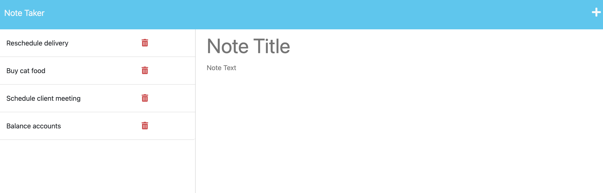

# 11 Note Taker

## Description 
For the module 11 assignment I built a back end for a note taker application using express. The application stores / retreives notes using a json file and the user can add and delete notes to the page.

## Installation
Use `npm install` to install express / the required packages.

## Usage
The user will need to click on the "Get Started" button on the home page to go to notes page. From the note taker page the user can add a new note which displays on the left side of the page. The user can also delete notes from the list.

## User Story

```
AS A small business owner
I WANT to be able to write and save notes
SO THAT I can organize my thoughts and keep track of tasks I need to complete
```

## Acceptance Criteria 

```
GIVEN a note-taking application
WHEN I open the Note Taker
THEN I am presented with a landing page with a link to a notes page
WHEN I click on the link to the notes page
THEN I am presented with a page with existing notes listed in the left-hand column, plus empty fields to enter a new note title and the note’s text in the right-hand column
WHEN I enter a new note title and the note’s text
THEN a Save icon appears in the navigation at the top of the page
WHEN I click on the Save icon
THEN the new note I have entered is saved and appears in the left-hand column with the other existing notes
WHEN I click on an existing note in the list in the left-hand column
THEN that note appears in the right-hand column
WHEN I click on the Write icon in the navigation at the top of the page
THEN I am presented with empty fields to enter a new note title and the note’s text in the right-hand column
```

## Mock-Up

The following image shows the web application's appearance and functionality:

